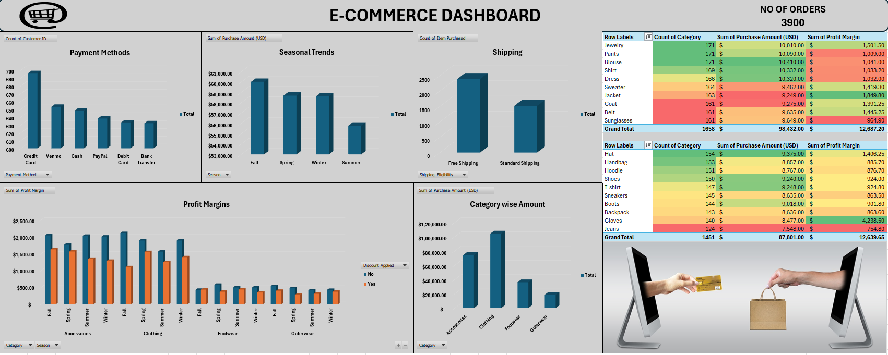

# E-COMMERCE_SALES

# 📊 PROJECT OVERVIEW

This dashboard provides a comprehensive view of the sales performance across the e-commerce platform, offering actionable insights for business growth. It serves as a vital tool for team discussions, aimed at enhancing revenue, optimizing operations, and improving the customer experience

# ⚙ TOOLS USED
 &nbsp;

 Microsoft Excel

# 🚀 PROJECT GOALS
- Increase Revenue Growth
- Optimize Seasonal Campaigns and Trends
- Improve Shipping Efficiency
- Promote High-Margin Products
- Boost Customer Satisfaction
- Maintain Category Leadership

# 📈 INSIGHTS
Key Insights from the Data
### Revenue Growth:

- Sales show a steady upward trend, with the highest revenue generated in the Fall season.
   
### Customer Preferences:

- Credit Cards are the most used payment method. Free Shipping is highly favored over Standard Shipping.
   
### Top Categories and Products:
  
- Clothing generates the most revenue, with Pants and Blouses leading sales.
- Accessories, like Jewelry, contribute significantly to profits.
   
### Seasonal Trends:
  
- Fall and Spring outperform other seasons in both sales and profit margins.
- Summer shows a decline in sales, indicating an opportunity for improvement.
   
### Profit Margins:
  
- Accessories and Clothing are the highest contributors to overall profit

# 🧠 DATA STORY

Additional Insights and Recommendations

- Underperforming Products:
  Items like Jeans, Gloves, and Backpacks contribute less to sales and profits.
- Discount Effects:
  Discounts drive more sales but reduce profit margins, requiring a balanced strategy.
  
### Actionable Recommendations

#### Seasonal Campaigns  
- Launch targeted marketing campaigns during **Fall** and **Spring** to maximize sales.  
- Introduce **Summer Sales Events** to drive customer interest during off-peak seasons.  

#### Product Optimization  
- Promote top-performing products like **Pants, Blouses, and Jewelry** in advertisements.  
- Reevaluate low-performing items (e.g., **Jeans and Gloves**) for redesign or discontinuation.  

#### Shipping Strategies  
- Expand **Free Shipping** to more products or orders above a minimum value.  
- Offer **expedited shipping options** to increase average order value.  

#### Payment Options
- Incentivize lesser-used methods like **Bank Transfers** with exclusive discounts or offers.  

#### Customer Retention Programs
- Introduce **loyalty programs** to reward repeat purchases and increase customer spending.  

#### Inventory Optimization  
- Reduce stock of underperforming products to minimize holding costs.  
- Use real-time inventory tracking to improve forecasting and supply chain efficiency.  

#### Category Expansion
- Explore new or trending product categories based on customer preferences and buying patterns.

# 📊 DASHBOARD

